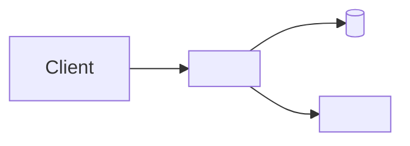

# Architecture

<!-- How the system is built: components, boundaries, data flow.
     Why an area is shaped a certain way goes to decisions/<area>.md, not here. -->

## Overview

<Two or three sentences.>

## Components

| Component | Responsibility | Owns data | Talks to |
|---|---|---|---|
| <name> | <...> | <...> | <...> |

## Seams

Places where a change typically lands. One concern — one seam (P-011).

| Seam | Concern | Guard / invariant |
|---|---|---|
| <e.g. single write path for X> | <...> | <...> |

## Cross-cutting values (single source of truth, P-010)

| Value | Resolved in | Consumers |
|---|---|---|
| <timezone / threshold / format> | <module> | <...> |

## Environments

| Env | Purpose | How deployed |
|---|---|---|
| local | development | <...> |
| staging | VERIFY sessions | <...> |
| production | users | <...> |
