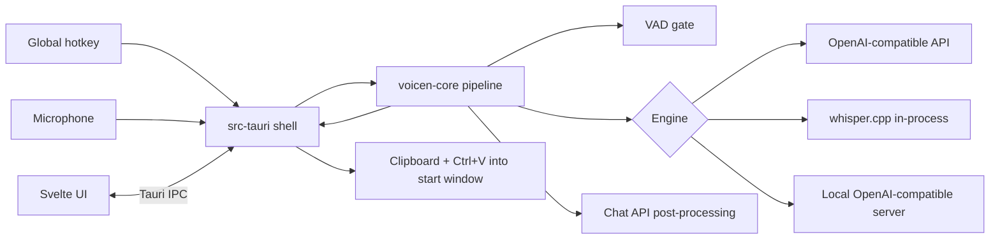

# Architecture

<!-- How the system is built: components, boundaries, data flow.
     Why an area is shaped a certain way goes to decisions/<area>.md, not here. -->

## Overview

A Tauri 2 desktop app for Windows. A Rust shell (`src-tauri`) owns everything Windows-specific (tray, global hotkey, audio capture, clipboard, SendInput paste, Credential Manager, notifications) and calls a platform-independent core library (`voicen-core`) that owns the dictation pipeline: VAD gate → engine → optional post-processing → delivery decision. The web UI (Svelte) renders settings, first run, history and the overlay, and talks to Rust only through Tauri IPC commands.

## Components

| Component | Responsibility | Owns data | Talks to |
|---|---|---|---|
| `voicen-core` (area `core`) | pipeline, engines behind one trait, VAD gate, settings model, history, pending recording, timeouts, build info | settings, history, local models, pending audio (via storage traits) | HTTP endpoints; platform services through traits |
| `src-tauri` shell | Windows services: hotkey, capture (cpal), clipboard, paste, Credential Manager, tray, toasts, autostart, logs; IPC commands | logs, crash files | `voicen-core`, Windows APIs, UI |
| UI (area `ui`) | settings, first run, history, overlay, About | none (state comes over IPC) | shell via IPC |

## Seams

| Seam | Concern | Guard / invariant |
|---|---|---|
| `Engine` trait in `voicen-core` | adding a provider | recording and delivery code do not change (NFR-11) |
| Platform traits (audio source, clipboard, input, credentials) | Windows vs tests | core tests run on Linux with fakes; Windows impls only in `src-tauri` |
| IPC commands | UI ↔ Rust | the UI never calls Windows APIs; e2e mocks exactly these commands |

## Cross-cutting values (single source of truth, P-010)

| Value | Resolved in | Consumers |
|---|---|---|
| version and commit | `voicen_core::build_info()` | About, start log line, CI smoke |
| data directory `%LOCALAPPDATA%\Voicen` | shell (one function) | logs, settings, history, models |
| timeouts (FR-24) | `voicen-core` | engines, post-processing |

## Environments

| Env | Purpose | How deployed |
|---|---|---|
| local (Linux) | development, `make check` | core in `voicen-rust:1.99`, UI on host with mocked IPC |
| windows-ci | "deployed": build, silent install, launch, log check | GitHub Actions `windows-latest` (`.github/workflows/ci.yml`) |
| owner's Windows PC | real mic, hotkey, paste; NFR-01/NFR-08; clean install in Windows Sandbox | installer artifact from CI |
| GitHub Releases | users | `v*` tag (publishing step: sprint task) |
