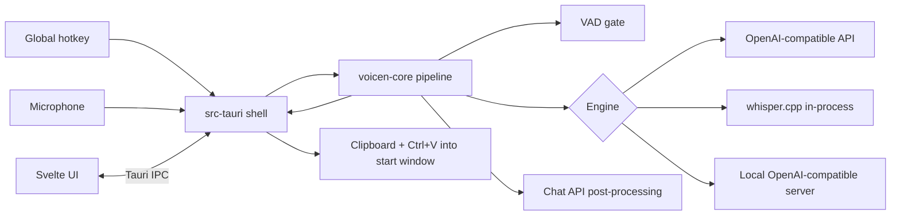

# Architecture

<!-- How the system is built: components, boundaries, data flow.
     Why an area is shaped a certain way goes to decisions/<area>.md, not here. -->

## Overview

A Tauri 2 desktop app for Windows. A Rust shell (`src-tauri`) owns everything Windows-specific (tray, global hotkey, audio capture, clipboard, SendInput paste, Credential Manager, notifications) and calls a platform-independent core library (`voicen-core`) that owns the dictation pipeline: VAD gate → engine → optional post-processing → delivery decision. The web UI (Svelte) renders settings, first run, history and the overlay, and talks to Rust only through Tauri IPC commands.

## Components

| Component | Responsibility | Owns data | Talks to |
|---|---|---|---|
| `voicen-core` (area `core`) | pipeline, recording controller and indicator state, engines behind one trait, VAD gate, settings model, history, pending recording, timeouts, build info | settings, history, local models, pending audio (via storage traits) | HTTP endpoints; platform services through traits |
| `src-tauri` shell | Windows services: hotkey, capture (cpal), clipboard, paste, Credential Manager, tray, toasts, autostart, logs; IPC commands; the settings window's lifecycle and the startup executor (`settings_window`, T-037) | logs, crash files | `voicen-core`, Windows APIs, UI |
| UI (area `ui`) | settings, first run, history, overlay, About; the settings window is the route `/settings` (`src/lib/settings/`: `settingsApi.ts` holds the only settings `invoke`/`listen` calls, `draft.ts` the draft; every `SettingsView` goes through `applyView`, refusals come from core and show as `error.<code>` on the field, the UI holds no defaults, rules or language list; T-004) | none (state comes over IPC) | shell via IPC |

## Seams

| Seam | Concern | Guard / invariant |
|---|---|---|
| `Engine` trait in `voicen-core` | adding a provider | recording and delivery code do not change (NFR-11); the one total factory `voicen_core::engine::engine_for(&Settings, &dyn CredentialStore)` (per job; a non-API kind or a stored base URL failing `check_base_url` → `EngineNotConfigured` without a key read, a key-store error → `KeyStoreUnavailable`; decision #44); every OpenAI-compatible request is built and sent only by `engine::openai::OpenAiCompatibleEngine::transcribe` (blocking reqwest, URL joined on the parsed base URL keeping its query, body capped at 1 MiB) and every transport failure goes through `failure::classify` to a `FailureReason` that never holds a URL, body or key (T-040) |
| `SpeechDetector` trait / `SpeechGate` in `voicen-core` `vad/` | is this recording speech (FR-12) | every speech decision is `vad::SpeechGate::decide` (infallible, `&self`, shared by workers): the primary's `Ok` answer, else `vad::energy::EnergyDetector` (R-5 rule with the [−70, −40] dBFS floor clamp and the 3-frame minimum run); a primary `Err` at construction or at run time latches the fallback for the gate's lifetime and never counts as speech; exactly one `GateDecision` per gate has `fallback_warning`; the gate emits no events, the pipeline does (T-041; Silero is T-043) |
| `RecordingController` in `voicen-core` `recording/` | is a recording on; what the tray and overlay show | the only place that starts or ends a recording and the only constructor of a `FinishedRecording` (a non-`Clone` `StopTicket` consumed by `finish`: at most one per press, none under 300 ms, on a capture error or for a stale id); the only owner of `IndicatorState` (changes only inside controller methods; `IndicatorState::derive` holds the two priority orders); sans-IO, no clock: every `Instant` comes from the caller's event; a capture error becomes `MicrophoneUnavailable{cause}` with a closed `MicCause`, never OS text; the engine = none check stays in `settings::gate::dictation_gate` (T-042) |
| `Pipeline::run_job` in `voicen-core` `pipeline.rs` | what happens to a finished recording | the only path a `FinishedRecording<PressContext>` takes (`PressContext { start_window, settings: Arc<Settings> }`, the snapshot taken at press; no `SettingsSource`, decision #47); blocking, on a plain std thread, never in a tokio runtime; two private halves, `process` (gate → engine from the one factory, default `engine_for`, with the job's snapshot and the pipeline's one `Timeouts` → `PostProcessor`) and `release` (`delivery::deliver` → pending slot → events), so T-011's queue goes between them; no factory call, credential read or request unless the gate says speech; the clipboard is written only for a non-blank text and Ctrl+V only after that write, per data-model "DeliveryDecision" (`MODIFIER_WAIT` 1 s, a `send_ctrl_v` error is copy-manual); one pending slot: a retryable failure stores its audio under a new `PendingId`, replaces the slot (none if the store failed) and deletes the older audio, `Text`/`NoSpeech` leave it; reported only as `JobReport { end: JobEnd, pending }` and `Copy` `DictationEvent`s on the one `PipelineObserver` (`[Warning]`, `SpeechGate`, `JobFinished` after the clipboard write, `[Delivered]`); `Instant::now()` only for event durations (T-001) |
| `Downloader` / `ModelStore` in `voicen-core` `local_models/` | is a built-in model on disk, and how it gets there (FR-08) | a file appears under a catalog model's final name only through `download::Downloader`, which renames `<file>.part` after the byte count equals the catalog size and the streamed SHA-256 (`sha2`) equals the pinned value; every other end (status, transport error, no data for `Timeouts::download_no_data`, disk error, size or hash mismatch, cancel) closes `<file>.part`, tries to remove it (best effort: a failed removal is ignored; the leftover is never read as a model, the next start truncates it and `ModelStore::cleanup_at_start` removes it) and clears the one active slot before the end event; blocking reqwest on its own std thread, no tokio; the no-data timeout is `ClientBuilder::timeout` (per read and per header wait), never a total one; failures are `download::DownloadFailure` (contracts/ipc.md codes; never the URL; reqwest errors reduced through `engine::openai`'s `send_error`/`body_error` facts), separate from `FailureReason`; `store::ModelStore` derives "downloaded" only from the disk (final file with the catalog size) and is the one `DownloadedModels` (T-016, decision #49) |
| Platform traits (audio source, clipboard, input, credentials) | Windows vs tests | core tests run on Linux with fakes; Windows impls only in `src-tauri`; `voicen_core::platform` holds `Clipboard`, `Paster`, `TempAudioStore`, `StartWindow`, `PendingId` with public fakes (feature `test-fakes`), errors carry no OS text (T-001); `events::PipelineObserver` with `RecordingObserver`; `post_process::PostProcessor` with `PassThrough` until T-020 |
| Settings window and startup | which window opens, and when | the `settings` window is created only by `src-tauri` `settings_window::open(app, tab, field)` (at most one; a later call focuses it and emits `settings://focus`); the startup window decision is only core `startup_action`, carried out by `settings_window::on_ready`, which `run()` calls on `RunEvent::Ready`; `tauri.conf.json` declares no window; the capability is granted to label `settings` only (T-037; why: `docs/decisions/settings-ui.md` S1) |
| IPC commands | UI ↔ Rust | the UI never calls Windows APIs; e2e mocks exactly these commands; one app wiring `build_app(builder, context, service)` in `src-tauri/src/lib.rs` (commands, managed settings service, change bridge) shared by `run()` and the shell tests; the wire form of the settings types is serde impls in `voicen-core` (spec 004 contracts/ipc.md › Wire form; T-030) |

## Cross-cutting values (single source of truth, P-010)

| Value | Resolved in | Consumers |
|---|---|---|
| version and commit | `voicen_core::build_info()` | About, start log line, CI smoke |
| data directory `%LOCALAPPDATA%\Voicen` | `src-tauri` `paths::data_dir()` (temp dir + `Voicen` when `LOCALAPPDATA` is unset; T-030) | logs (`paths::log_dir()` = `data_dir()\logs`), settings (`FsSettingsFile::new(data_dir)` inside `settings_ipc::load_settings`), later history, models |
| timeouts (FR-24) | `voicen_core::timeouts::Timeouts::default()` (connect 5 s, API 30 s, local server 60 s, post-processing 15 s, built-in 120 s, model download no-data 30 s per read); engines read them from each `TranscribeRequest` and store none | engines (through `Pipeline`, which holds the one value: `Pipeline::new` always uses the defaults), post-processing, `local_models::download::Downloader` (given at construction) |
| audio sent to engines | `voicen_core::audio::AudioBuffer` (16 kHz mono i16 only: `from_16k_mono`, or `from_frames` = channel average + rubato resampling); `audio::wav::encode` writes the upload WAV; `Debug` prints no samples | capture (T-006, handed in through `RecordingController::finish`, T-042), engines, pending recording |
| built-in model catalog (FR-08) | `voicen_core::local_models::catalog::MODELS` (five entries, one pinned Hugging Face commit, sizes and SHA-256 from its LFS metadata; `ModelId::as_str` stable strings) | `ModelStore`, `Downloader`, settings `builtin_local.model_id`, IPC (T-044), the built-in engine (T-017) |
| user-visible text | `i18n/{en,ru}.json` via `voicen_core::i18n` and `$lib/i18n` | shell, UI |
| settings defaults | `voicen_core::settings::defaults(os_tag)` (container-level serde default; one source) | `Settings` deserialization, first run, reset, UI |
| API keys | `voicen_core::secrets::CredentialStore` by `KeySlot`; the only impl is `src-tauri` `credentials::WinCredentialStore` (Credential Manager, targets = `KeySlot::target_name()`; T-030); the file, `SettingsView`, events, IPC errors and logs never hold a key | engines and post-processing (read), settings save (write, delete) |
| speech-language list | `voicen_core::settings::WHISPER_ISO_639_1` (Whisper languages with an ISO 639-1 code; no copies); the UI picker reads it from core over IPC (#30; T-030/T-004) | validation (`language.unsupported`), UI picker, engines |
| base-URL rule | `voicen_core::settings::url::check_base_url`; its trim + one-`/` rule is `normalize_base_url`, also the storage form of every base URL (T-032) | validation, settings save (normalize), connection test, engines |
| settings file `settings.json` | `voicen_core::settings::file::FsSettingsFile` (`SETTINGS_FILE`, tmp + sync + rename, `settings.json.bad-<UTC>` backups); read and written only by `SettingsService` (T-032) | settings load and save |
| settings service | built only by `src-tauri` `settings_ipc::load_settings(data_dir, credentials, autostart, os_language)` (release: `WinCredentialStore::new()`, `WinAutostart::new()`, `locale::os_language()`; tests inject fakes and a temp dir; T-030, T-014); it calls `reconcile_autostart` right after the load | `run()` (managed state), shell tests |
| start with Windows (logon entry) | `voicen_core::autostart::Autostart`, called only by `SettingsService` (save step when `start_with_windows` changes, `reconcile_autostart` at start; none while `Unavailable`); the only impl is `src-tauri` `autostart::WinAutostart`: `HKCU\Software\Microsoft\Windows\CurrentVersion\Run` value `RUN_VALUE_NAME` = `Voicen`, `REG_SZ` `"<current exe>" --autostart` (T-014). Why: `docs/decisions/settings.md` | settings save, startup, `launched_by_autostart` (`settings_window::on_ready`, T-037), 006's uninstaller (deletes the same value name) |
| settings in force | `SettingsService::snapshot()`; changes published only by `SettingsService::subscribe()` (std `mpsc`, one `Arc<Settings>` per `Saved`; decisions #22) | shell, engines, post-processing, history |
| `settings://changed` event | emitted only by the shell's subscribe bridge `settings_ipc::spawn_change_bridge` (payload `SettingsService::view()`; one per `Saved` from any caller; T-030) | every open window |
| `settings://focus` event | emitted only by `settings_window::open` when the `settings` window already exists (payload `{tab, field?}`, tab = `voicen_core::settings::gate::SettingsTab::as_str`, field = `FieldId::as_str`, omitted when absent; T-037) | the settings window |
| settings tab token | `SettingsTab::as_str` (closed match; contracts/ipc.md tokens) | window URL `settings?tab=`, `settings://focus` |
| wall clock | `voicen_core::clock::Clock` (`SystemClock`; `utc_compact` for the backup suffix) | settings backup name, history (005), connection test (R-9) |
| hotkey grammar | `voicen_core::settings::hotkey` (`parse_hotkey`, canonical text only) | validation, UI capture, registrar |
| accepted licenses and third-party notices | `about.toml` (`accepted`, one list; decisions #9, #24) | cargo-about (Windows-target crates, build/dev deps ignored), `scripts/licenses` (npm packages in the client bundle, written by the Vite plugin `voicen-bundled-packages`, fail closed: a bundled module or asset that is neither project source nor attributed to a package fails the check; Vite's and rolldown's helper modules count as `vite` and `rolldown`; plus `licenses/manual.json`), `make licenses-check` in `make check`; the committed `THIRD-PARTY-NOTICES.txt` (generated by `make licenses`; the workspace's own crates are checked but not listed); NSIS uses `compression: "zlib"` so no CPL-1.0 enters the list (#29). Why: `docs/decisions/licenses.md` |
| UI language | `SettingsView.settings.ui_language` (default from `resolve_ui_language`, T-004); the UI never derives it | UI, shell text |

## Environments

| Env | Purpose | How deployed |
|---|---|---|
| local (Linux) | development, `make check` | core in `voicen-rust:1.99`, UI on host with mocked IPC |
| windows-ci | "deployed": build, silent install, launch, log check | GitHub Actions `windows-latest` (`.github/workflows/ci.yml`) |
| owner's Windows PC | real mic, hotkey, paste; NFR-01/NFR-08; clean install in Windows Sandbox | installer artifact from CI |
| GitHub Releases | users | `v*` tag (publishing step: sprint task) |
