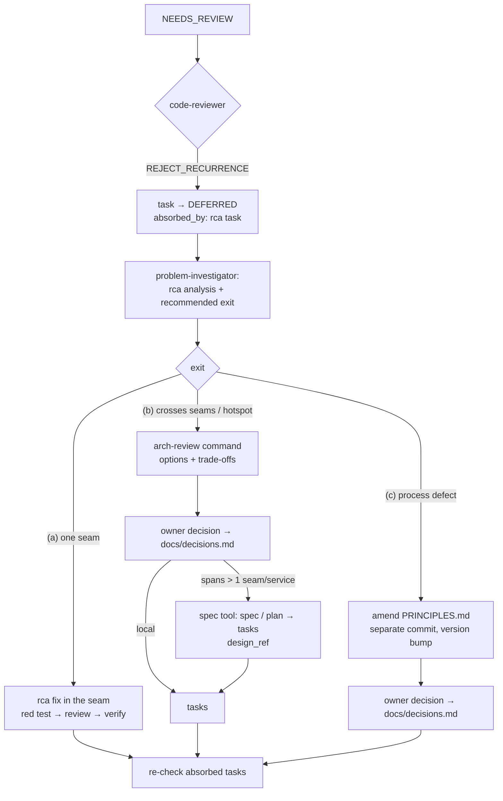

# Task lifecycle

How a unit of work moves from idea to done, and which evidence each step requires.
The rules here are what the reviewer, the hooks and the metrics scripts check against.

## 0. Where tasks come from

**Before the first task: the requirements.** `docs/requirements.md` is the product's requirements document — problem, release-1 goal and scope, functional requirements in EARS form with a failing example each, measurable non-functional requirements, constraints, glossary, integrations, technical decisions, assumptions. `/teamwright:requirements` builds it from the owner's brief or an interview; a fresh `requirements-reviewer` roasts each draft (`docs/requirements.reviews/<n>.md`, verdict `READY` / `NOT_READY`) until it is ready, and the owner approves it. Specs and tasks are derived from the approved version; a spec that contradicts it is a question for the owner. `/teamwright:init` starts here; `/teamwright:adopt` runs it when the document is still the template.

| Size of the work | Path |
|---|---|
| **Large** — spans more than one seam or service, or carries product uncertainty (what to build is not settled) | The project's spec tool first (`tools.spec`, see [tools.md](tools.md)): specify → clarify → plan → tasks; with no spec tool, a plain `docs/specs/<name>.md` the owner agrees. Each item of the resulting task list becomes a task record with `design_ref` pointing to the spec/plan section it implements |
| **Small** — one seam, behaviour already agreed | Straight into a task record; no spec |

The spec tool's own implement/apply step is **not** used: implementation always goes through the lifecycle below (analysis, red tests, review, verification). A spec answers *what* and *why*; the task record answers *where exactly, how we know it holds, and who checked*.

Doubt about the size is resolved towards a spec when two or more seams would change together — that is exactly the kind of change a local task tends to patch in one place and miss in another.

## 1. The task record

One markdown file per task in `docs/tasks/T-NNN.md` (the file name is the id — hooks look it up by id), YAML front matter first.
Template: `docs/tasks/_task-template.md`.

| Field | Required | Meaning |
|---|---|---|
| `id` | always | `T-NNN`, monotonic, never reused or renumbered (ids live in commits and links) |
| `title` | always | One line, observable outcome |
| `type` | always | `feature` · `bug` · `rca` (root-cause analysis) · `chore` |
| `status` | always | See the status machine below |
| `sprint` | always | Sprint the task was **created** in; never changes |
| `priority` | always | `P0`…`P3` by observable effect, not by importance to the author |
| `depends_on` | optional | Task ids that must be `VERIFIED` or `DONE` first (the router's readiness rule, section 4) |
| `deploys` | optional | `false` for work with no deployable artifact (docs, scripts, config) |
| `surface` | always | What verification must exercise: `api` · `ui` · `both` · `none` (section 7). Left empty, the task cannot reach `VERIFIED` or `DONE` |
| `verify_exception` | optional | One line: why the change cannot be checked by an api/ui test; the only thing that allows a `kind: manual` verify record. Reviewed like code |
| `design_ref` | when created from a spec | Link to the spec/plan section the task implements (relative path + anchor) |
| `class` | optional | Defect class, kebab-case (`input-parsing`, `auth-session`); set by whoever creates the task or the investigator; tasks of one class are recurrence candidates, metrics count tasks per class, `/arch-review` groups by it |
| `recurrence_of` | when detected | Earlier tasks that fixed the same class of defect |
| `absorbed_by` | when deferred into a root task | Id of the `rca` task that now owns this scope |
| `blocked_on` | optional | Soft hold: free text (waiting for evidence or a person), or open-question ids (`OQ-02`, `OQ-02, OQ-05`) when the task must not be analysed before they are answered — a sentence in the body is not enough, the router reads only this field. Free text holds until cleared to `""`; OQ ids hold until each is resolved in `docs/open-questions.md` (its Status starts with `answered` or `dropped`; `closed`, `resolved` and `done` are read the same way) |
| `analysis` | before `IN_PROGRESS` | `root_cause`, `evidence`, `invariant`, `seam`, `approach` for `feature`, `bug` and `chore`. `type: rca` needs `root_cause`, `evidence`, `decision` instead (the chosen exit and what it changes; `invariant` and `seam` are expected for exit (a)). Checked by the analysis gate |
| `implemented_by` | set at `→ NEEDS_REVIEW` | Who implemented the task: the role file (`developer`, `developer-<area>`) or `human:<name>`. The orchestrator sets it in the same edit that moves the task to `NEEDS_REVIEW`. The gates identify implementing agents from their own ledger (`.teamwright/sessions/<ID>.dev`) regardless; the field adds the check for people: a reviewer or a manual verifier equal to `implemented_by` is refused |
| `review` | optional | `skipped:trivial` — the exit from the review gate for a change with no design freedom; stays in the record (`gates.md`) |
| `tail_code` | optional | `ratified` — the owner explicitly accepts that this task's code is pushed although the task is not in an approved status (for example a patch kept as a marked temporary workaround in a `DEFERRED` task) |

Review records live next to the task: `docs/tasks/T-NNN.reviews/<n>.md`, one file per round, written only by the `code-reviewer` agent (the review gate checks the agent type). The number of review rounds is **the number of those files** — hooks and metrics count them; no agent maintains a counter by hand.

Verification records live next to them: `docs/tasks/T-NNN.verify/<n>.md`, one file per verification run (section 7). Template: `docs/tasks/_verify-template.md`.

Rules:
- `evidence` is concrete: `file:line`, a log line, a failing test name. "I think" is not evidence. For a feature, `root_cause` states the need the change answers and `evidence` the requirement, spec section or failing acceptance test behind it.
- `invariant` states what must stay true after the change, phrased so a test can check it.
- A `chore` with no degrees of freedom may write `analysis: skipped:trivial` — anything touching behaviour may not.
- `type: rca` is not an exemption: the investigation fills the analysis block (`root_cause`, `evidence`, `decision`) first, and code under an `rca` task is edited only after it is complete. For exits (b) and (c), `decision` holds the owner's decision, not the investigator's recommendation, before the task enters `IN_PROGRESS`.
- Entering `IN_PROGRESS` makes the task the active one: the analysis gate writes its id to `.teamwright/current-task`, and code edits are checked against that task.
- New tasks go into the **active** sprint only (section 8).

## 2. Status machine

```mermaid
stateDiagram-v2
    [*] --> TODO
    TODO --> ANALYSIS: picked by readiness rule
    ANALYSIS --> IN_PROGRESS: analysis block filled
    ANALYSIS --> DEFERRED: instance of a known root (absorbed_by)
    ANALYSIS --> BLOCKED: no evidence yet / needs a person
    IN_PROGRESS --> NEEDS_REVIEW: gate green, docs updated, local commit
    IN_PROGRESS --> BLOCKED: needs a person / a decision (flow stop condition)
    NEEDS_REVIEW --> IN_PROGRESS: REQUEST_CHANGES
    NEEDS_REVIEW --> CODE_COMPLETE: APPROVE (record by code-reviewer)
    NEEDS_REVIEW --> DEFERRED: REJECT_RECURRENCE -> rca task (absorbed_by)
    NEEDS_REVIEW --> BLOCKED: ESCALATE (owner decision)
    CODE_COMPLETE --> DEPLOYED: pushed in DRAIN (pre-push)
    CODE_COMPLETE --> DONE: deploys false (+ PASS verify record per surface; none for surface none)
    CODE_COMPLETE --> VERIFIED: deploys false, PASS verify record against a local run
    CODE_COMPLETE --> VERIFY_FAIL: deploys false, FAIL verify record
    CODE_COMPLETE --> IN_PROGRESS: acceptance FAIL (task-validator)
    DEPLOYED --> VERIFIED: PASS verify record for the deployed commit
    DEPLOYED --> VERIFY_FAIL: FAIL verify record
    DEPLOYED --> IN_PROGRESS: acceptance FAIL (task-validator)
    VERIFY_FAIL --> ANALYSIS: re-analyse, do not re-patch
    VERIFIED --> DONE
    BLOCKED --> TODO: dependency done / decision made
    DEFERRED --> TODO: root done, scope re-checked
    DONE --> [*]
```



- `ANALYSIS` and `IN_PROGRESS` are transient: a task should not survive a session boundary in them.
- Review verdicts are exactly `APPROVE | REQUEST_CHANGES | REJECT_RECURRENCE | ESCALATE`. The reviewer writes the record; the **orchestrator** changes the status according to it. `NEEDS_REVIEW → CODE_COMPLETE` requires a latest record with `APPROVE` written by the `code-reviewer` agent, never by the author (review gate).
- A review returns the task only for a finding at or above the project's threshold (`process.review.blocking`, default `low` = any finding), a Critical one, or one of the always-blocking categories (`secret-leak`, `security`, `weakened-test`, `done-not-working`, `recurrence`); the review gate checks the verdict against the record's findings table. Findings below the threshold leave the task `APPROVE`d and become lines in the sprint's `review-follow-up` task.
- Two `REQUEST_CHANGES` records in a row → stop. The task is not returned to the same author a third time, and the third attempt is not approved either: the third record's verdict is `ESCALATE` (owner) or `REJECT_RECURRENCE` (section 6) — the review gate refuses anything else. An `APPROVE` or `ESCALATE` ends the run, so a task back from `VERIFY_FAIL` or from an owner decision starts a new count.
- **A recurrence never parks the original task in `BLOCKED`.** It goes to `DEFERRED` with `absorbed_by: <rca id>`. `BLOCKED` is reserved for "waiting for a person or for evidence". When escalated patches were parked as `BLOCKED`, nothing owned them: they piled up next to the root task, each was retried on its own, and the queue grew faster than it could be worked. `DEFERRED + absorbed_by` gives every such task an owner and a single exit — the root task.
- `VERIFY_FAIL` goes back to `ANALYSIS`, not `IN_PROGRESS`: a failed verify means the analysis was wrong.
- An acceptance `FAIL` from the `task-validator` (the verify record passed, but a mutation survived, docs drifted or a claim has no evidence) goes back to `IN_PROGRESS` with its findings, then through review again: the analysis held, the proof did not.
- `IN_PROGRESS → BLOCKED`: work stopped on a person or a decision (`sessions.md` §4), with the question in `blocked_on`. The task re-enters through `TODO` and keeps its analysis.
- `DEPLOYED` means pushed during DRAIN. Whether anything was deployed is checked by the smoke in verification (section 7), not by the pipeline's status; no hook reads the pipeline.
- When a root task reaches `DONE`, tasks it absorbed are **re-checked**, not auto-closed: close them only if their reproduction no longer fires.

## 3. Definition of Done per status

| Leaving… | …requires |
|---|---|
| `TODO → ANALYSIS` | Task is ready (section 4) |
| `ANALYSIS → IN_PROGRESS` | `analysis` block filled with real evidence; recurrence check done (grep `docs/failures.md` and past tasks for the same class) |
| `IN_PROGRESS → NEEDS_REVIEW` | Gate `make test` (or the project's `<gate command>`) green; a test that fails without the change (red-before-fix); docs touched by the change updated in the same commit; local commit, **no push** |
| `NEEDS_REVIEW → CODE_COMPLETE` | Latest review record `APPROVE` from the `code-reviewer` agent; findings fixed or filed; no principle violated without a recorded exception |
| `CODE_COMPLETE → DEPLOYED` | Pushed during DRAIN (the `pre-push` hook checks every task in the tail); the deploy itself is proven later by the smoke (section 7) |
| `DEPLOYED → VERIFIED` | A `PASS` verify record of each kind `surface` requires, for the deployed commit (section 7): API tests and/or an end-to-end UI test run per `surface`, including the **failure branch** from Acceptance, checked against data/logs — not against the system's own text output |
| `VERIFIED → DONE` (or `CODE_COMPLETE → DONE` when `deploys: false`) | A `PASS` verify record for the current code per `surface` (with `deploys: false` the system is started locally; `deploys: false` + `surface: none` needs none); nothing left in the task that is "temporary" without a linked follow-up; the latest `task-validator` validation record (`docs/tasks/<ID>.validation/<n>.md`) is `PASS` for the current code (`FAIL` → back to `IN_PROGRESS` with its findings; `NEEDS_OWNER` → waits for the owner). The verify gate checks the verify record and, on entering `DONE`, that the latest acceptance verdict is `PASS` and was written by `task-validator` (T3). With `deploys: false` + `surface: none` the acceptance verdict is the only check |

Per type, in addition:

| Type | Extra |
|---|---|
| `bug` | Reproduction recorded before the fix; the new test fails on the old code |
| `feature` | Acceptance criteria from `docs/requirements.md` each mapped to a test or a verify step; created from a spec → `design_ref` set |
| `rca` | Root cause written; the chosen exit (section 6) recorded; decision appended to `docs/decisions.md` (and the area file if any); failure entry in `docs/failures.md`; follow-up tasks created |
| `chore` | Gate green; if it changed a contract or config, the runtime actually reads the new value |

## 4. Readiness rule

The "what next" list is derived, never curated by hand:

```
ready = { status: TODO, every depends_on is VERIFIED or DONE,
          blocked_on is empty or names only OQ-NN that are resolved }
resolved = the question's Status cell in docs/open-questions.md starts with
           answered, dropped, closed, resolved or done
order = effective priority (P0 > P1 > P2 > P3) → number of open tasks it blocks (desc) → id (asc)
effective priority = the highest priority of the task itself and of every open task
                     that depends on it, directly or transitively
```

A task that is not ready is not picked, even if it looks easy.

The router, `tw-next.py`, lives in the plugin, not in the project: `/teamwright:flow` and `/teamwright:status` call it, and other runtimes run `python3 <kit>/scripts/tw-next.py --json` (`<kit>` = the plugin directory). It computes the next action deterministically from task files, review and verify records, journals, `.teamwright/current-task`, `TEAMWRIGHT_PAUSE` and git state. Its order: an interrupted or dirty task first (`resume`); then `ANALYSIS` / `IN_PROGRESS` (`continue`); `NEEDS_REVIEW` without a record (`review`); `CODE_COMPLETE` / `DEPLOYED` without a `PASS` verify record for the current code (`verify`) and `VERIFY_FAIL` (`reanalyze`); `BLOCKED` with an owner decision pending (`decide`); then the ready set above (`start`). Nothing left → `idle`; pause file → `paused`. Finishing started work before starting new work keeps tasks from surviving session boundaries in transient statuses.

## 5. Commit convention

- Status change: `chore(task): T-042 NEEDS_REVIEW→CODE_COMPLETE` — one transition per line in the subject or body. Metrics parse this (`metrics.md`); keep the exact form.
- Code change: `<type>(<scope>): T-042 <what changed>` — the task id is always present.
- Agent-written commits carry a `Co-Authored-By:` trailer.
- A deliberate symptom-level workaround carries an `RCA: T-NNN` trailer pointing to the root task, so the history shows it was a choice. Patch-guard accepts only this trailer as the link to a root task — mentioning a task id elsewhere in the message does not count. Other overrides: `docs/process/gates.md`.
- Push only in DRAIN: `pre-push` lets a task's code leave the machine only when the task is `CODE_COMPLETE`, `DEPLOYED`, `VERIFIED` or `DONE`, or carries `tail_code: ratified`.

## 6. Recurrence → three exits

The failure mode this prevents: agents fix a class of bugs by adding one more `if`, one more allowlist entry, one more special case — and each patch passes review because each looks reasonable alone.

1. **Reviewer checks every fix** against `docs/failures.md`, `PRINCIPLES.md` and recent tasks touching the same seam. Question: *is this the same fix pattern as before?*
2. **On a recurrence** the fix is **not** accepted as another patch.
   - The reviewer creates a `type: rca` task file with the invariant in its acceptance and `recurrence_of: [...]` listing the earlier tasks, then writes its review record with `verdict: REJECT_RECURRENCE` and `rca_task: <rca id>`.
   - The orchestrator moves the current task to `DEFERRED` with `absorbed_by: <rca id>` — never to `BLOCKED` (section 2). Its patch is reverted, or kept only if explicitly marked temporary (`RCA:` trailer, `tail_code: ratified` if it must be pushed).
3. **The investigator** fills the rca task's analysis and **recommends one of three exits** — the level at which the class actually lives:

| Exit | When | What happens | Who decides |
|---|---|---|---|
| **(a) Root cause in code** | One seam; an invariant in that seam closes the class | The rca task goes on through the normal lifecycle: red test for the invariant → fix in the seam → review → verify. Absorbed tasks are re-checked when it is `DONE` | investigator recommends, lifecycle as usual |
| **(b) Architecture review** | The class crosses seams or services, the seam itself is wrong, or the area is a hotspot in `teamwright-metrics` | Run `/arch-review` (`.claude/commands/arch-review.md`): options with trade-offs → owner decision in `docs/decisions.md`. If the chosen change spans more than one seam or service, it goes back through the spec tool (new spec/plan → tasks, each with `design_ref`); otherwise it becomes ordinary tasks | **owner** |
| **(c) Process amendment** | The class is a process defect: code was right to do what the process allowed (a missing template field, a gate with no exit, a rule nobody checks) | Amend `PRINCIPLES.md` (and the spec tool's constitution, if kept) in a **separate commit** with a version bump; record it in `docs/decisions.md`; move the rule up a tier if needed (`principles.md` §2) | **owner** |

   Exits combine: a process amendment often comes with a code task for the instance at hand. The rca task is closed when the chosen exit has produced its artefacts (fix, decision + tasks, or amendment), not when the analysis is written.

   **How an rca task reaches `DONE`:**
   - **(a)** like any task: `IN_PROGRESS` → red test for the invariant → fix → review → verify per its `surface` → `DONE`.
   - **(b) and (c)** produce no deployable code of their own. The owner's decision goes into `decision:` (and `docs/decisions.md`) before `IN_PROGRESS`; the task carries `deploys: false` and `surface: none`. In `IN_PROGRESS` the orchestrator and roles produce the artefacts — follow-up task records with `design_ref` (b), or the separate `PRINCIPLES.md` amendment commit (c), plus the `docs/failures.md` entry. Then `NEEDS_REVIEW`: a fresh code-reviewer checks the artefacts against the decision → `CODE_COMPLETE` → `DONE` (the verify gate needs no record for `deploys: false` + `surface: none`). The follow-up tasks run their own lifecycle; absorbed tasks are re-checked when those are `DONE`.
4. **The rca task** also records the story in `docs/failures.md` and the decision in `docs/decisions.md` (+ area file).
5. **Limits:** an `rca` task that itself hits recurrence stops the loop and goes to the owner (depth ≤ 1). One reviewed task may spawn at most two new tasks; more goes into one umbrella task.
6. **Expect the next sprint to grow** — in the source process one sprint roughly tripled in task count once recurrences were split out. Growth here is the rule working (hidden debt becoming visible), not a planning failure.



## 7. Verification of the running system

Tests in the gate prove the code; verification proves the **running system** does what the task says, through its real interface. It is the last step before `VERIFIED` and is recorded, not reported.

**When:** after review approval and the push (`DEPLOYED`), in a VERIFY session (`sessions.md`). With `deploys: false` and `surface` `api` / `ui` / `both`, against a locally started system; `deploys: false` + `surface: none` needs no record.

**Who:** the `task-validator` agent, fresh context. It runs the suites and writes the record; it never edits code or tests. A failing run is a finding, not something to fix on the spot.

**What runs, by `surface`:**

| `surface` | Required kind(s) | Tool |
|---|---|---|
| `api` | `api` | the project's API test suite against the running service (HTTP/gRPC client tests, contract tests) |
| `ui` | `ui` | an end-to-end UI test run with the project's UI runner (`tools.ui_verify`: Playwright for web by default; Patrol, Flutter `integration_test`, Maestro, Espresso / XCUITest for mobile) |
| `both` | `api` + `ui` | both of the above |
| `none` | — with `deploys: false`; otherwise a deploy `smoke` (or `api` / `ui`) | internal code, libraries, docs, scripts: the gate tests are the proof of the code, the smoke proves the deploy |

Plus `kind: smoke` for a deploy: the service is up **and running the pushed commit** (version endpoint, startup log) — a green pipeline is not proof that anything was deployed.

- **The failure branch is mandatory.** The Acceptance section names the input that reproduced the defect (or the edge case of a feature); the verification exercises exactly that input and checks the result in stored state or logs, not in the system's own message.
- **Exploration is not evidence.** An interactive session (a browser or device driven through an MCP tool, an emulator) is fine for finding selectors and reproducing a bug, but the recorded evidence is a **test run** — a committed test executed by its runner, with its report. The `test-writer` writes these end-to-end tests from the Acceptance failure branch, like any red test.
- **`kind: manual`** is allowed only when the task carries an explicit `verify_exception` (real payment, physical device, third-party account) — and the record then says exactly what was observed.

**The record** — `docs/tasks/T-NNN.verify/<n>.md`, one per run:

| Field | Content |
|---|---|
| `task`, `round` | task id and round number — must match the file name; the next round is always last + 1 |
| `kind` | `api` · `ui` · `smoke` · `manual` |
| `tool` | the driver, required for `ui`: the configured runner's value — `playwright` · `patrol` · `flutter-integration-test` · `maestro` · `espresso` · `xcuitest` |
| `command` | exact, copy-pasteable command that was run |
| `environment` | `local` · `staging` · `production-like` (never a host or an address) |
| `commit` | the revision that was verified; must contain the task's last code commit |
| `result` | `PASS` · `FAIL` |
| `evidence` | the artifact the run produced: report dir, junit xml, trace, log (existing repo-relative path or CI artifact URL) |
| `verifier` | the writer's agent type, or `human:<name>` for a person |

The body lists the scenarios checked and must contain a `Failure branch: …` line — the failure branch from Acceptance and what was observed. Records are append-only: a re-run or a correction is the next round. A `kind: manual` record counts only with `verify_exception` and must come from someone other than the implementer.

`VERIFIED` and `DONE` require, per `surface`, a latest `PASS` record of each required kind for the **current** code — a record for a commit older than the task's last code commit does not count — and the latest record overall must not be `FAIL`. `FAIL` → `VERIFY_FAIL` → `ANALYSIS`. Enforcement (verify gate, T3) and exits: `gates.md`.

## 8. Sprints

A sprint is a planning unit, not a gate: a goal and the list of tasks planned for it, in `docs/sprints/<N>.md` (template `docs/sprints/_sprint-template.md`). No hook reads sprint files, and the router (`/teamwright:flow`) ranks every open task record whatever its sprint; metrics count tasks per sprint from the `sprint:` field.

- **Active sprint** = the highest-numbered `docs/sprints/<N>.md`. A new task gets that `N` in `sprint:`, and the field never changes.
- **Opening.** Sprint 1 is created by `/teamwright:adopt` or `/teamwright:init`. The next one is planned when the router reports `idle` ("plan the next sprint") or the owner asks: in the main session the orchestrator proposes a goal and tasks (from the backlog list in the previous sprint file, `docs/open-questions.md`, `docs/failures.md`, the metrics), the owner agrees or changes it, and the orchestrator writes `docs/sprints/<N+1>.md` and the task records and commits them (`docs(sprint<N+1>): plan`). There is no separate planning session type.
- **Closing.** A sprint is done when each of its tasks is `DONE` or `DEFERRED` — read from the task records, never set by hand. Unfinished tasks keep their `sprint:` and stay in the queue; the router picks them up regardless. At close the orchestrator (or the technical-writer) fills "What it turned out to be".
- **No statuses in the sprint file.** A task's status lives only in its record; the sprint file lists ids, titles, priorities and seams.
