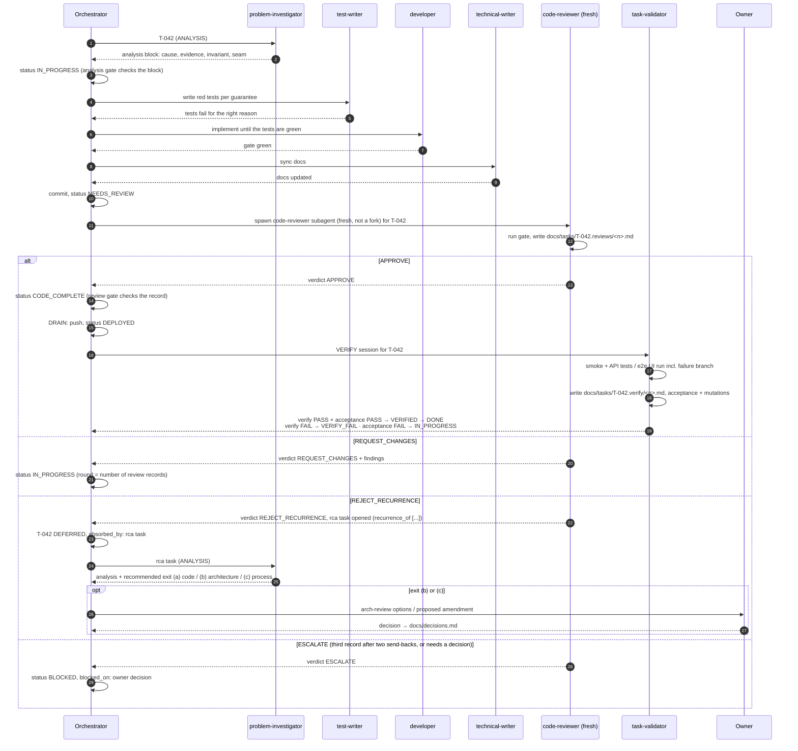

# Roles: who does what, and why

teamwright splits the work on a task between several agents with narrow jobs. The split is not about specialisation for its own sake — each boundary is there to prevent a specific failure that shows up when the two jobs are merged.

## The roles

| Role | Question it answers | Output | Model |
|---|---|---|---|
| Orchestrator | What is next, and who does it? | status changes, commits | main session |
| problem-investigator | *Why* does this happen, and where must the fix go? | `analysis` block: root cause + evidence, invariant, seam, approach; for a recurrence — the recommended exit | strong (opus) |
| test-writer | How will we know the guarantee holds? | red tests, one per guarantee; end-to-end tests for the Acceptance failure branch | opus (default; change per role file) |
| developer | What is the minimal change in that seam? | code, green gate | opus (default; change per role file) |
| technical-writer | Do the docs still tell the truth? | doc edits, decisions / failures entries | lighter (sonnet) |
| requirements-reviewer | Can the product be specified and tested from these requirements? | roast record `docs/requirements.reviews/<n>.md`: findings, pre-mortem, questions for the owner, `READY` / `NOT_READY` | strong (opus) |
| code-reviewer | Is this correct — and is it the same bug again? | review record `docs/tasks/<ID>.reviews/<n>.md`: verdict + counted findings | strong (opus) |
| task-validator | Is the task done *as written*, and does the running system prove it? | verify records `docs/tasks/<ID>.verify/<n>.md` (PASS / FAIL); acceptance PASS / FAIL / NEEDS_OWNER with evidence | strong (opus) |
| Owner | Which option, at what cost? | decisions in `docs/decisions.md` (escalations, architecture reviews, process amendments) | human |

Role definitions: `.claude/agents/`. Tool-agnostic summary: `AGENTS.md`.

The model is set explicitly in each role file and chosen by task class, not by prompt text: to run a class of tasks on another model, copy the role file with a different `model:` and route that class to it (`docs/process/sessions.md` §5).

## Why each boundary exists

- **Requirements author ≠ requirements reviewer.** The session that interviewed the owner fills gaps with its own reading of what was meant; a fresh reviewer reads only what is written and finds the requirement nobody can test and the flow that stops halfway — before they become code.
- **Investigator ≠ developer.** An agent that investigates and fixes in one go stops at the first plausible cause and patches the symptom. Forcing a written analysis (with evidence and an invariant) *before* code makes the cause checkable by someone else.
- **Test-writer before developer.** A test written after the code tends to describe the code, not the guarantee. A test that was red first is proof it can fail.
- **Review is a separate, fresh agent.** An author reviewing its own diff — or a fork that inherits the author's context — shares the author's blind spots and rationalisations. A reviewer that starts cold, reads the principles and the failure log, and runs the gate itself is the only review that counts.
- **Validator ≠ reviewer.** Review asks "is the code right?"; validation asks "is every claim of the task backed by evidence?". The validator also applies 1–3 mutations to critical guarantees only (secret or transcript leak, data loss, the Acceptance failure branch, the task's invariant; decision #32) — on a throwaway copy of the tree, never in the working tree — to prove the tests actually bite. It writes the verify record the verify gate requires for `DONE` (T3); its acceptance verdict (`PASS` / `FAIL` / `NEEDS_OWNER`) is a validation record `docs/tasks/<ID>.validation/<n>.md` with the commit it checked; the orchestrator acts on it, and the verify gate refuses `DONE` unless the latest verdict is `PASS` and was written by the validator (T3).
- **Verifier ≠ author, and never a fixer.** The validator runs verification of the running system in the VERIFY session — API tests for APIs, an end-to-end UI test run for UI (with the project's configured UI runner), smoke for deploys — and writes a verify record. It never edits code or tests: a verifier that may fix what it finds starts adjusting the check to the system instead of the other way round.
- **Owner decides levels above the task.** The investigator may *recommend* an architecture review or a process amendment; only the owner chooses between architectures or changes the rules. An agent that rewrites its own constitution to make a failure go away removes the signal, not the defect.
- **Writer inside the task.** Docs updated "later" drift, and the next agent reads the drift as truth.

## Recurrences: three exits

Agents are good at local fixes. Left alone, they fix a class of bugs by adding one more `if`, one more allowlist entry, one more special case in the same area — each patch looks correct in its own diff, so a diff-only review approves it.

The reviewer therefore checks every fix against history: `git log` of the touched area, `docs/failures.md`, `recurrence_of` of related tasks. If the fix repeats a pattern for the same class of bug, the verdict is `REJECT_RECURRENCE`:

1. the reviewer opens a new `type: rca` task, linked via `recurrence_of: [earlier tasks]`, and names it in the review record (`rca_task`);
2. the orchestrator moves the original task to `DEFERRED` with `absorbed_by: <rca id>`; its patch is reverted, or kept explicitly marked as a temporary workaround;
3. the investigator finds the invariant and the seam, and **recommends the exit** — the level where the class lives:
   - **(a) code** — one seam, one invariant: the rca task is fixed through the normal lifecycle;
   - **(b) architecture** — the class crosses seams or services, or sits in a hotspot: `/arch-review` lays out options with trade-offs, the owner decides, and a change spanning more than one seam goes back through the spec tool as a new spec/plan → tasks with `design_ref`;
   - **(c) process** — the code did what the process allowed: the owner amends `PRINCIPLES.md` (separate commit, version bump).

   Every exit ends with the decision in `docs/decisions.md` and the story in `docs/failures.md`.

**What to expect.** In the project this process was extracted from, agents had been patching a multi-service backend for months; each fix passed review. Once the reviewer learned to detect recurrences, the next sprint roughly tripled in size — most of the new tasks were root-cause work that had been hidden behind patches. The growth is the debt becoming visible, not the process failing.

## A task through the roles

Status machine: `docs/process/lifecycle.md`. Session types and the outcome contract: `docs/process/sessions.md`. Principles and their enforcement tiers: `PRINCIPLES.md`.
