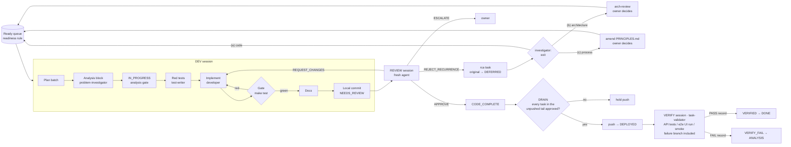

# Sessions

Work happens in short sessions of four kinds (plus an occasional architecture review with the owner). Each has one job, a fixed exit and a fresh context.
Splitting them is what makes review real and pushes safe.

## 0. Starting and resuming

`/teamwright:flow` is the entry point for every working session in Claude Code. It asks the router (`tw-next.py --json` in the plugin, see `lifecycle.md` §4; other runtimes run `python3 <kit>/scripts/tw-next.py --json`) for the next action, shows a one-screen status, and runs the matching session below — DEV, REVIEW, DRAIN or VERIFY — with fresh role subagents. It asks the owner only at decision points (task choice when asked, large work → spec tool, escalation and recurrence exits (b)/(c), push, `NEEDS_OWNER`), stops on escalation, a `TEAMWRIGHT_PAUSE` file or its budget (`--tasks N`, default 1), and ends with a summary and an `Outcome:` line.

After an interruption the next `/teamwright:flow` gets `resume`: it reconstructs the step from the task record, `git status`, the diff and the last `chore(task)` commit — never from a previous session's memory — and continues from there. Changes in the tree that do not belong to the task are left alone and reported.

## 1. Who does what

| Session | Actor | Does | Never does |
|---|---|---|---|
| **DEV** | orchestrator with role subagents: `problem-investigator`, `test-writer`, `developer`, `technical-writer` | Pick batch → `ANALYSIS`: investigator fills `analysis` → `IN_PROGRESS` (analysis gate) → test-writer: red tests → developer: implement until green → gate → technical-writer: docs → orchestrator: local commit, `NEEDS_REVIEW` | Push; mark its own work reviewed |
| **REVIEW** | `code-reviewer` subagent, fresh context (spawned by the orchestrator, never a fork of the author) | Read diff + task + principles + failures; run the gate; detect recurrence (opening the `rca` task file); write the review record `docs/tasks/<ID>.reviews/<n>.md` with one verdict | Edit code, tests or docs — every finding, however small, goes back to DEV; change task statuses; review code it wrote |
| **DRAIN** | orchestrator | Push only when every task referenced in the unpushed tail is `CODE_COMPLETE`, `DEPLOYED`, `VERIFIED` or `DONE` (or carries `tail_code: ratified`); flip to `DEPLOYED` | Push selectively (a push ships the whole tail) |
| **VERIFY** | `task-validator` agent, fresh context | Run the verification suites per `surface` against the running system (API tests; end-to-end UI run with the configured UI runner; deploy smoke), failure branch included; write the verify record `docs/tasks/<ID>.verify/<n>.md`; acceptance check (DoD evidence, mutations) | Edit code or tests to make a run pass; accept a happy-path run, an interactive exploration or the system's own text as proof |
| **ARCH-REVIEW** (on demand) | orchestrator + owner, `/arch-review` | For a recurrence whose exit is (b): options with trade-offs from hotspots and seams; owner decision into `docs/decisions.md`; follow-up spec/plan or tasks | Decide for the owner; start implementation in the same session |
| **Owner** | human | Decides forks, approves escalations, breaks review loops | Rubber-stamp; the owner is a decision point, not a reviewer of every diff |

Self-review never counts. An internal quality check inside DEV is allowed and useful, but it does not replace REVIEW.

## 2. Outcome contract

Every session ends with exactly one outcome, written in its final message. The session-end hook journals it, with the session's tool calls, into `.teamwright/logs/` — metrics and routing read the journal, not the message:

| Outcome | Meaning |
|---|---|
| `barrier` | Work done, committed locally; next session type is determined |
| `idle` | Ready queue empty — nothing to pick |
| `escalate` | Nothing at all can proceed without the owner (global block, not one blocked task) |
| `interrupted` | Stopped mid-step (owner interrupt, a role agent that crashed without a result, context limit near) — written by the session when it still can; a session cut off without a final message is journaled as `none`, and the router resumes the current task either way |

One blocked task is **not** `escalate`: mark it `BLOCKED` with a reason, report it, keep picking other ready tasks.
A session that ends without an outcome is a defect in the process — the next session cannot route. The `Outcome:` line is the last line of the final message, in plain text; the Stop hook reads it from the message, or from the transcript when the runtime does not pass the message. A session never ends its turn while a role agent it spawned is still running: role agents run in the foreground, and each result is committed before the next step. When the runtime runs a role in the background and the turn ends anyway, the hook journals `waiting`; only the session's last turn counts as its outcome.

## 3. Batching

| Rule | Why |
|---|---|
| **Default: 1 task per session** | One task, one diff, one review — the cheapest thing to get right |
| **Maximum 3 tasks per batch** | Beyond that the diff stops being reviewable and seams start to interact |
| **Only low-priority tasks (`P2`/`P3`) with no blockers** | Nothing in `depends_on` open, `blocked_on` empty, no other task waiting on it. `P0`/`P1` and tasks others wait on always go alone — **project override (decision #71):** up to two `P1` tasks may run in parallel when their seams share no file, each in its own git worktree with its own gate run, review and push |
| **A red gate fails the whole batch** | The batch shares one gate run; no task in it moves to `NEEDS_REVIEW` until all are green |
| Group by seam and deploy unit | One push ships the batch; mixing units smears it across pipelines |
| Each task keeps its own acceptance, commit line, status and review record | Batching shares execution, not accountability |

These are written rules (T0): neither the router nor `/teamwright:flow` checks a batch's priorities or blockers; `--tasks N` only sets how many tasks the session may take.

## 4. Stop and check with the owner

Stop the session (outcome `escalate` or a `BLOCKED` task + question) when:
- the task needs a product decision or a fork between approaches with different costs;
- review has returned the task twice in a row (two `REQUEST_CHANGES` records): the third record is `ESCALATE` or `REJECT_RECURRENCE`;
- an `rca` task itself shows a recurrence;
- the fix requires rewriting a function marked dangerous in `CLAUDE.md` / `docs/decisions/`;
- the change touches secrets, auth, money, data deletion or migrations and the task did not say so;
- the canon requires something the tools don't allow (see `principles.md` §3) — report the gap, don't route around it silently;
- the investigator recommends exit (b) architecture review or (c) process amendment for a recurrence (`lifecycle.md` §6) — both are owner decisions;
- verification cannot be automated for a task (`kind: manual` needs a `verify_exception` the owner accepts).

Record the owner's answer in `docs/decisions.md` (proposed-by: agent / decided: owner).

## 5. Model by task class

| Task class | Model tier |
|---|---|
| DEV or REVIEW on a risky seam (concurrency, data writes, auth, money, contracts, migrations, known hotspots) | Strongest available |
| REVIEW of any task with a recurrence flag | Strongest available |
| DEV on isolated, well-specified feature work | Mid tier |
| Docs sync, formatting, status flips, log summarisation, search | Cheap tier is fine |

The model is fixed in each role file's front matter (`model:`), and the orchestrator picks the role file by the task's class (type, priority, seam) — not by asking for a model in the prompt text. A model requested in prose is a hint that can silently fall back to a weaker default; a role file per class is a fact. Defaults in `.claude/agents/`: `problem-investigator`, `code-reviewer`, `task-validator`, `developer`, `test-writer` — `opus`; `technical-writer` — `sonnet`. For a cheaper developer on isolated work, copy the role file (e.g. `developer-light.md`) with another `model:` and route that class to it.

A cheap model is **not** used for DEV or REVIEW of risky seams. If you find yourself adding deterministic scaffolding to make a cheap model behave on a critical step, the tier is wrong — raise it instead.

## 6. Context hygiene

- Start each session cold from the task record and the map (`CLAUDE.md`), not from a previous session's memory.
- Read the area file in `docs/decisions/` **before** editing that area.
- Keep tool output short (head/tail, counts); large dumps crowd out the task.

## 7. The VERIFY session

Run after DRAIN for every task that reached `DEPLOYED` (and for `deploys: false` tasks with `surface` `api` / `ui` / `both`, against a locally started system).

1. **Start cold** from the task record: `surface`, Acceptance (especially the failure branch), `verify_exception`, the latest review record.
2. **Smoke the deploy:** the service answers and runs the pushed commit (version endpoint or startup log). A green pipeline is not proof.
3. **Run the suites** that `surface` requires — `api` → the API test suite against the running service; `ui` → an end-to-end UI test run with the configured UI runner ([tools.md](tools.md)); `both` → both; `none` → the smoke alone. The failure-branch input from Acceptance must be among the executed tests.
4. **Check the effect in data or logs**, not in the UI text or the API's own success message.
5. **Write one record per run** — `docs/tasks/<ID>.verify/<n>.md` from `docs/tasks/_verify-template.md`, with Edit/Write (the verify gate refuses shell writes): `task`, `round`, `kind`, `tool`, `command`, `environment`, `commit`, `result`, `evidence` (the report / junit / trace the run produced), `verifier`, and a `Failure branch:` line in the body. Never edit an earlier round — a re-run is the next round. Add one line per round to the task's `## Verification` section.
6. **Acceptance check** in the same pass: DoD evidence and targeted mutations on a throwaway copy (`task-validator`), appended to `## Validation`.
7. **Outcome:** all records `PASS` for the current commit → orchestrator sets `VERIFIED`, then `DONE`. Any `FAIL` → `VERIFY_FAIL` → `ANALYSIS`: a failed verification means the analysis missed something; it is not patched in the VERIFY session.

Interactive tools (a browser or device MCP, an emulator, a REPL against the API) help to explore and to reproduce; the evidence is always a committed test executed by its runner. A missing end-to-end test for the failure branch is a finding for `test-writer`, not a reason to verify by hand.
